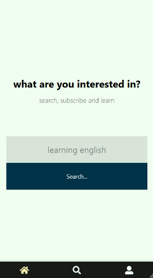

# InfoLearn
InfoLearn is a social network for learning. You can publish short texts and InfoLearn repeats these texts for you to memorize them.

This repository is the frontend code in VueJs. it proivdes user interface for InfoLearn.



## Setup
Create an `.env.developement` and `.env.production` files in the root with below contents
```
VUE_APP_API_URL=http://localhost:3000/ #api end point
```
then
```
npm install
```
For APIs see [InfoLearn backend repositry](https://github.com/ferrriii/infolearn-backend).

### Compiles and hot-reloads for development
```
npm run serve
```

### Compiles and minifies for production
```
npm run build
```

### Test
```
npm run test
```

### Lints and fixes files
```
npm run lint
```

### e2e test
```
npm run test:e2e
```

### Unit test
```
npm run test:unit
```